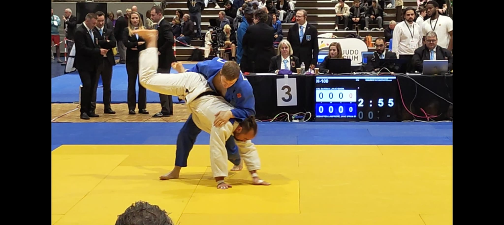

::: {.page-header-custom}
# About

I am a doctoral researcher in Economics at KU Leuven. I work under the supervision of Johannes Van Biesebroeck and expect to complete my PhD in summer 2027.
:::

## Background

Before joining KU Leuven in 2021, I was a research assistant at ECARES–ULB and at the Collège de France, and an economic and statistical analyst trainee at the European Commission’s Directorate-General for Economic and Financial Affairs.

::: {.info-grid}
::: {.info-card}
### Research fields

Industrial organization  
International trade  
Macroeconomics
:::

::: {.info-card}
### Languages

Native speaker of French and Dutch; fluent in English, Spanish, and German.
:::
:::

::: {.judo-band}

::: {.judo-copy}
## Beyond economics

I began practicing judo at age six and earned my black belt in 2013. In 2025, I became Belgian national champion in the −100 kg category. I continue to compete alongside my academic work.
:::
:::

## Contact

**Sébastien Lamproye**  
Department of Economics, KU Leuven  
Naamsestraat 69, 3000 Leuven, Belgium  
[sebastien.lamproye@kuleuven.be](mailto:sebastien.lamproye@kuleuven.be)
