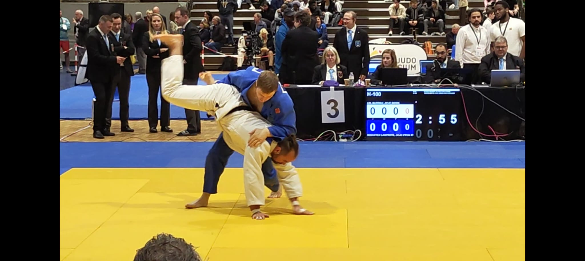

::: {.hero .column-screen}
::: {.hero-copy}
<div class="eyebrow">2026–27 Economics Job Market</div>

# Sébastien<br>Lamproye

<div class="hero-role">PhD Fellow in Economics · KU Leuven</div>

<p class="hero-intro">I study how firm market power shapes welfare, market structure, and aggregate economic outcomes.</p>

<div class="field-list">Industrial Organization · Trade · Macroeconomics</div>

<div class="hero-actions">
  <a class="button-link primary" href="research.html">View research</a>
  <a class="button-link" href="cv.html">CV</a>
  <a class="button-link" href="mailto:sebastien.lamproye@kuleuven.be">Email</a>
</div>
:::

::: {.hero-visual}
<picture class="hero-picture">
  
</picture>
:::
:::

::: {.section-wrap .column-screen}
::: {.section-heading}
## Research

::: {.section-copy}
At the [Department of Economics at KU Leuven](https://feb.kuleuven.be/research/economics), I conduct my research in the [IO Group](https://sites.google.com/view/ioleuven/home) under the supervision of [Prof. Johannes Van Biesebroeck](https://sites.google.com/view/jovb/). I plan to complete my PhD in summer 2027.

My work combines theory and firm-level data to study market power, firm performance, production networks, and misallocation.

My doctoral research is supported by a competitive [PhD Fellowship in Fundamental Research](https://www.fwo.be/en/support-programmes/all-calls/phd/phd-fellowship-fundamental-research/) from the Research Foundation – Flanders (FWO).
:::
:::

::: {.paper-feature}
::: {}
<div class="paper-kicker">Job Market Paper</div>

### Market Power and Firm-Level Welfare Incidence

Which firms account for the welfare cost of market power? I develop a firm-level welfare-incidence measure that combines markup wedges, firm size, demand curvature, and expenditure reallocation to identify where aggregate welfare losses originate.

[Read about the paper →](research.html#job-market-paper){.link-arrow}
:::

::: {.paper-meta}
**Fields**  
Industrial organization  
Macroeconomics

**Setting**  
Belgian firm-level data, 1980–2024

**Status**  
Draft in progress
:::
:::
:::

::: {.section-wrap .tint .column-screen}
::: {.section-heading}
## Selected work

My broader research studies how market power propagates through production networks, how trade reallocates research effort, how information affects platform competition, and how innovation shapes economic opportunity.
:::

::: {.research-grid}
::: {.research-card}
<span class="status">Working paper</span>

### Aggregating Markups in Production Networks

With [Emmanuel Dhyne](https://orbi.umons.ac.be/profile?uid=501113) (National Bank of Belgium and University of Mons). An economy-wide measure of market power that accounts for the position of firms in production networks.
:::

::: {.research-card}
<span class="status">Submitted</span>

### When Comparison Makes Markets Tip

With [Duy-Anh Phan](https://sites.google.com/view/phan-dda/welcome) (Monash University). How comparability can intensify competition while making two-sided markets more likely to tip.
:::

::: {.research-card}
<span class="status">Revise and resubmit</span>

### Technological Knowledge Intensity and Intergenerational Mobility

Evidence on the relationship between patent-based knowledge intensity and upward mobility across U.S. regions.
:::

::: {.research-card}
<span class="status">Submitted</span>

### Equal Static Gains, Unequal Growth: Trade and the Allocation of R&D

How trade reforms with identical current real-income gains can have opposite effects on long-run growth by reallocating scarce research labor across sectors.
:::
:::

<p style="margin-top:2rem">[See all research →](research.html){.link-arrow}</p>
:::

::: {.section-wrap .personal-wrap .column-screen}
::: {.judo-band}
::: {.judo-copy}
## Beyond economics

I began practicing judo at age six and earned my black belt a decade later. In 2025, I became Belgian national champion in the −100 kg category, and I continue to compete and teach judo alongside my academic work.
:::

```{=html}
<div class="judo-gallery">
  
  <!-- Permanent original-hero framing: small blue shoulder edge, no partner's face. Do not substitute the full two-person original or the tighter solo crop. -->
  
</div>
```
:::

::: {.contact-card}
### Contact

<div class="contact-email"><a href="mailto:sebastien.lamproye@kuleuven.be">sebastien.lamproye@kuleuven.be</a></div>

Department of Economics, KU Leuven<br>
Naamsestraat 69, 3000 Leuven, Belgium
:::
:::
